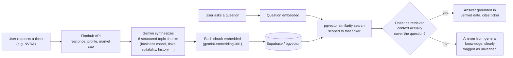

# StockSage

A RAG-powered investment chatbot backend that gathers **real, live data** on any publicly traded stock the moment it's asked about — then answers questions grounded in that data, falling back to general AI knowledge (clearly labeled as such) only when the verified data genuinely doesn't cover the question.

Built entirely on free-tier services. No pre-built catalog, no stale data — every stock is researched live, on demand.

Powers the AI chat feature in [Signalist](https://github.com/akachi11/signalist), a stock-tracking frontend.

## How it works

There's no static database of assets. Instead, the moment a user asks about a stock, the backend researches it live:



The grounded/unverified decision isn't a similarity-score cutoff — it's made by Gemini itself in a single structured call that returns `{ answer, grounded }`, because a cosine-similarity threshold turned out to be unreliable once retrieval is scoped to one company (it always finds *something* from that company, even when nothing actually answers the question).

The whole asset/chunk store is wiped on every server boot — each run starts from a clean slate rather than accumulating stale tickers.

## Tech stack

| Layer | Choice |
|---|---|
| Server | Node.js + Express |
| Database | Supabase (Postgres + `pgvector`) |
| Embeddings | Gemini `gemini-embedding-001` (768-dim) |
| Generation | Gemini `gemini-3.1-flash-lite`, structured JSON output |
| Live market data | Finnhub (company profile + quote) |

Every piece runs on a free tier.

## Getting started

```bash
npm install
cp .env.example .env   # fill in the keys below
npm start
```

### Required environment variables

| Variable | Where to get it |
|---|---|
| `SUPABASE_URL` | Supabase project → Settings → Data API |
| `SUPABASE_SERVICE_ROLE_KEY` | Supabase project → Settings → API Keys (service role / secret key — bypasses RLS, server-side only) |
| `GEMINI_API_KEY` | [Google AI Studio](https://aistudio.google.com/apikey) |
| `FINNHUB_API_KEY` | [finnhub.io/register](https://finnhub.io/register) (free tier) |
| `PORT` | optional, defaults to `3000` |

### Database setup

Two tables (`assets`, `asset_chunks` with a `vector(768)` column) plus a `match_asset_chunks` Postgres function that does the similarity search, with an optional ticker filter so one conversation doesn't leak chunks from a different company seeded earlier in the same session. See `src/lib/supabaseClient.js` and `src/lib/seedAsset.js` for the exact schema this code expects.

## API

### `POST /seed/:ticker`

Researches a stock in real time and stores it. Skips the work if that ticker was already seeded this session.

```bash
curl -X POST http://localhost:3000/seed/AAPL
```

```json
{ "ticker": "AAPL", "alreadySeeded": false, "chunkCount": 8, "riskLevel": "moderate" }
```

### `POST /chat`

```bash
curl -X POST http://localhost:3000/chat \
  -H "Content-Type: application/json" \
  -d '{"question": "Is this a risky investment?", "ticker": "AAPL"}'
```

```json
{
  "answer": "Apple is classified as moderate risk, facing supply chain and regulatory pressures...",
  "sources": ["AAPL"],
  "grounded": true
}
```

`ticker` is optional — omit it to search across every ticker seeded so far this session. `grounded: false` means the answer came from general knowledge, not verified data; `sources` is empty in that case.

### `GET /health`

Liveness check.

## Project structure

```
src/
  config/env.js       env loading + validation
  lib/
    finnhub.js         live market data
    gemini.js           embeddings
    chat.js              hybrid grounded/general-knowledge answering
    seedAsset.js         the real-time research pipeline
    retrieval.js         ticker-scoped similarity search
    resetDatabase.js     wipes state on boot
  routes/
    seed.js, chat.js     the two endpoints above
scripts/
  test-retrieval.js      CLI: npm run retrieve -- "a question"
```

## License

MIT
